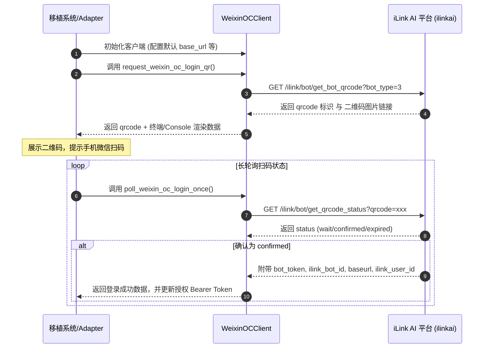
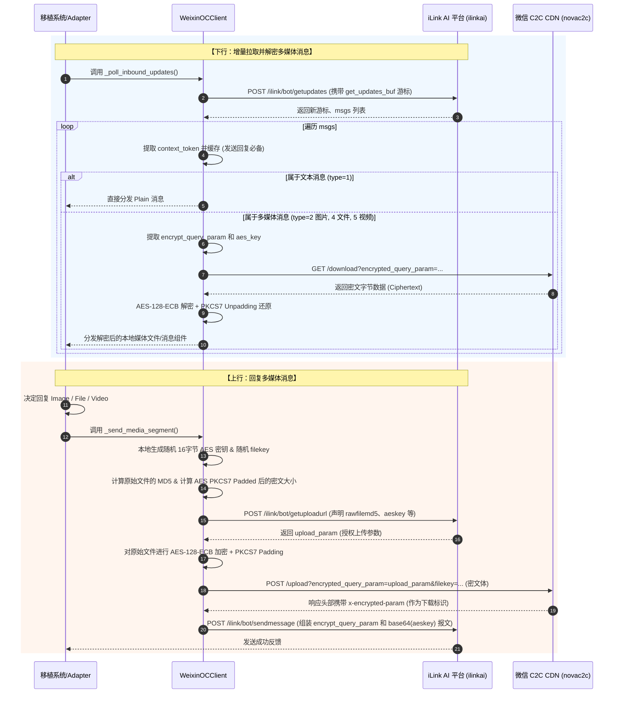

# 微信个人号 (weixin_oc) 接入功能分析与移植指南

本指南对 `AstrBot` 项目中通过 **微信对话开放平台 / 智能对话平台 (iLink AI)** 接入个人微信（`weixin_oc` 模块）的实现机制进行深度技术剖析，并提供完整的模块设计与移植方案。

---

## 一、 核心接入原理

在 `AstrBot` 中，个人微信的接入并非通过市面上常见的 Hook 注入（如 WeChat Ferry、NTChat 等）或 Web 协议模拟（如 Wechaty 的 UOS 协议），而是基于 **腾讯微信官方的智能对话平台 iLink AI (ilinkai.weixin.qq.com)**。

> [!NOTE]
> **iLink AI 托管机制**  
> 用户通过手机微信扫码后，将个人微信账号的对话通道授权给微信智能对话开放平台。该平台对外暴露基于 HTTP/HTTPS 协议的标准 API 和 CDN 接口，允许开发者通过长轮询（Long Polling）方式实现消息的增量拉取与实时响应。

### 接入方案对比与技术优势

| 维度 | 本方案 (iLink AI) | 传统 Hook 方案 (如 WCF) | 网页版协议 (如 Web-Wechaty) |
| :--- | :--- | :--- | :--- |
| **官方合规性** | **高（官方接口与协议）** | 极低（注入客户端，极易封号） | 较低（非旧版微信无法登录） |
| **部署便利性** | **高（纯 API，无需 Windows 挂机）** | 低（必须挂机运行微信客户端） | 中（需要解决各种扫码风控） |
| **多媒体支持** | **全支持（支持图片/视频/文件/语音）**| 全支持 | 受限 |
| **安全机制** | **强（所有多媒体文件采用 AES 端到端加密）**| 无（明文保存） | 弱（基于 Cookie 会话） |
| **稳定性** | **极高（微信骨干网 CDN 传输）** | 依赖本地微信进程稳定性 | 极差（容易断线） |

---

## 二、 系统架构与双向数据流

`weixin_oc` 的工作流程分为**登录认证**、**增量拉取消息（Downstream）**、**消息响应与多媒体端到端加解密（Upstream）**三个部分。

### 1. 登录认证流程



### 2. 消息双向传输与多媒体加解密流



---

## 三、 接口及协议详细拆解

所有的 API 请求都需要带上基础的 HTTP 头部，包含 `Authorization`（除登录外均需带上 `Bearer <bot_token>`）和特定的 UIN。

```python
# 默认的基础 Header 构建
headers = {
    "Content-Type": "application/json",
    "AuthorizationType": "ilink_bot_token",
    "X-WECHAT-UIN": base64.b64encode(str(random.getrandbits(32)).encode("utf-8")).decode("utf-8"),
}
```

### 1. 登录与生命周期管理

#### 1.1 获取托管登录二维码
* **方法**：`GET`
* **终结点 (Endpoint)**：`ilink/bot/get_bot_qrcode`
* **参数**：
  * `bot_type`：机器人类型，默认为 `"3"`。
* **返回 JSON 结构**：
  ```json
  {
    "ret": 0,
    "errcode": 0,
    "errmsg": "ok",
    "qrcode": "唯一二维码ID（用于状态轮询）",
    "qrcode_img_content": "weixin://qr/xxxx (用于生成二维码的协议链接)"
  }
  ```

#### 1.2 轮询扫码确认状态
* **方法**：`GET`
* **终结点**：`ilink/bot/get_qrcode_status`
* **Headers**：需额外加入 `"iLink-App-ClientVersion": "1"`
* **参数**：
  * `qrcode`：1.1 步中返回的 `qrcode` 字符串。
* **返回 JSON 结构**：
  ```json
  {
    "ret": 0,
    "errcode": 0,
    "errmsg": "ok",
    "status": "wait | confirmed | expired | cancel",
    "bot_token": "Bearer 授权令牌 (仅 confirmed 状态返回)",
    "ilink_bot_id": "微信 Bot 的唯一标识 (仅 confirmed 状态返回)",
    "baseurl": "接口的分配域名 (如有，之后以该基地址为准)",
    "ilink_user_id": "绑定的用户标识"
  }
  ```

---

### 2. 增量消息收取 (Long Polling)

为实现实时、低延迟收信，客户端通过循环发起长轮询来感知新消息。

* **方法**：`POST`
* **终结点**：`ilink/bot/getupdates`
* **请求 Payload**：
  ```json
  {
    "base_info": {
      "channel_version": "astrbot"
    },
    "get_updates_buf": "上一次拉取后返回的游标，初次拉取传空字符串"
  }
  ```
* **返回 JSON 结构**：
  ```json
  {
    "ret": 0,
    "errcode": 0,
    "errmsg": "ok",
    "get_updates_buf": "下一次增量请求需要携带的新游标 Buffer 字符串",
    "msgs": [
      {
        "from_user_id": "发送者的唯一微信加密 ID (如: wxid_xxxx)",
        "to_user_id": "接收者的加密 ID",
        "message_id": "唯一消息 ID",
        "create_time_ms": 1717123456000,
        "context_token": "非常关键！用于回复该会话的上下文 Token",
        "item_list": [
          {
            "type": 1,
            "text_item": {
              "text": "文本消息内容"
            }
          }
        ]
      }
    ]
  }
  ```

> [!IMPORTANT]
> **Context Token 的管理**  
> 在微信 iLink 体系中，发送回复或状态消息**必须**携带该会话最新的 `context_token`。如果在 `getupdates` 中收到新的 `context_token`，系统必须立刻更新本地对应的缓存，否则将导致发信失败。

---

### 3. 消息发送机制

#### 普通文本消息发送
* **方法**：`POST`
* **终结点**：`ilink/bot/sendmessage`
* **请求 Payload**：
  ```json
  {
    "base_info": {
      "channel_version": "astrbot"
    },
    "msg": {
      "from_user_id": "",
      "to_user_id": "接收人 user_id (即拉取消息时的 from_user_id)",
      "client_id": "客户端生成的随机 UUID 字符串 (用于防重)",
      "message_type": 2,
      "message_state": 2,
      "context_token": "该会话对应的最新 context_token",
      "item_list": [
        {
          "type": 1,
          "text_item": {
            "text": "需要回复给用户的文本"
          }
        }
      ]
    }
  }
  ```

---

### 4. "正在输入" 状态模拟

微信还支持了原生“正在输入...”状态的展示，移植此功能可以大幅度优化等待大模型输出时的用户视觉体验。

#### 4.1 获取 Typing 凭证 (Ticket)
* **方法**：`POST`
* **终结点**：`ilink/bot/getconfig`
* **请求 Payload**：
  ```json
  {
    "ilink_user_id": "目标用户 ID",
    "context_token": "该用户的 context_token",
    "base_info": { "channel_version": "astrbot" }
  }
  ```
* **返回**：含有 `"typing_ticket"`。

#### 4.2 发送输入状态
* **方法**：`POST`
* **终结点**：`ilink/bot/sendtyping`
* **请求 Payload**：
  ```json
  {
    "ilink_user_id": "目标用户 ID",
    "typing_ticket": "上一步获取的 ticket",
    "status": 1,  // 1: 开始输入; 2: 结束/取消输入
    "base_info": { "channel_version": "astrbot" }
  }
  ```

---

## 四、 多媒体传输与端到端加密安全机制

为了保证用户隐私，iLink AI 传输的所有媒体文件（图片、视频、文件、语音）均采用了端到端加密机制。**多媒体文件的加解密与 CDN 握手是移植该功能最核心的难点。**

### 1. 加密核心算法规范
* **算法模式**：**AES-128 ECB** (`AES.MODE_ECB`)
* **填充标准**：**PKCS7 Padding** (16 字节分块)
* **传输介质**：二进制密文字节数据。
* **密钥编码**：多媒体消息投递时，密钥经过 Base64 编码以字符串 `"aes_key"` 传输。

---

### 2. 媒体发送流程 (三步法)

若要在微信中给用户发送一张图片或文件，程序需按如下步骤工作：

#### 第一步：向 iLink 申请 CDN 上传通道
* **接口**：`POST /ilink/bot/getuploadurl`
* **载荷参数**：
  ```json
  {
    "filekey": "随机生成的 32 位 UUID 字符串",
    "media_type": 1, // 1: 图片, 2: 视频, 3: 文件
    "to_user_id": "目标用户 ID",
    "rawsize": 20480, // 原始文件字节大小
    "rawfilemd5": "原始文件的 md5 32位十六进制字符串",
    "filesize": 20496, // 经过 AES PKCS7 Padding 加密后的预期密文大小 (16字节对齐)
    "no_need_thumb": true,
    "aeskey": "生成并用于本次加密的 32位 16进制 AES 密钥字符串",
    "base_info": { "channel_version": "astrbot" }
  }
  ```
* **返回**：`upload_param`（加密查询参数）以及可选的 `upload_full_url`。

#### 第二步：本地 AES 加密并上传至 CDN
1. 读取文件的原始字节，对其进行 **PKCS7 Padding** 16字节对齐。
2. 使用第一步指定的 **AES Key**（ECB模式）进行加密，生成二进制密文。
3. 发送 `POST` 请求到 `https://novac2c.cdn.weixin.qq.com/c2c/upload?encrypted_query_param=<upload_param>&filekey=<filekey>`，请求体为**密文数据**，`Content-Type` 为 `application/octet-stream`。
4. 从 CDN 响应的 **Response Headers** 中提取 Header 键 **`x-encrypted-param`** 的值。该值即为我们在第三步中需要的下载凭证（也叫 `download_param`）。

#### 第三步：将 CDN 关联信息封装发送至 `/ilink/bot/sendmessage`
将第二步获得的 `download_param` 和 Base64 编码的 AES 密钥（`aes_key`）封装在 `item_list` 中并投递：

* **图片载荷样例 (type=2)**：
  ```json
  {
    "type": 2,
    "image_item": {
      "media": {
        "encrypt_query_param": "CDN返回的 x-encrypted-param",
        "aes_key": "Base64编码后的AES密钥字符串 (例如: YmFzZTY0X2Flc19rZXk=)",
        "encrypt_type": 1
      },
      "mid_size": 20496 // 密文尺寸大小
    }
  }
  ```

---

### 3. 媒体接收流程 (两步法)

当增量拉取获取到了类型为 `2 (图片)`, `4 (文件)`, `5 (视频)` 消息时：

#### 第一步：从微信 C2C CDN 下载加密字节
1. 提取多媒体 Item 里的 `encrypt_query_param` (或 `encrypt_query_param`) 字段。
2. 拼接下载 URL：`https://novac2c.cdn.weixin.qq.com/c2c/download?encrypted_query_param=<encrypt_query_param>`
3. 发送 `GET` 请求下载二进制密文字节数据。

#### 第二步：本地解密并恢复文件
1. 提取多媒体 Item 里的密钥，如果字段 `aeskey` 存在，将其转为十六进制字节；若 `aes_key` 存在，将其进行 Base64 解码。
2. 使用该密钥进行 **AES-128-ECB** 解密密文字节。
3. 对解密后的明文字节执行 **PKCS7 Unpadding** 剔除填充位，即可完美还原成原始图片/视频文件存入磁盘。

---

## 五、 端到端加密及多媒体通信 Python 核心实现

为了方便进行功能移植，以下提取并精简了 `AstrBot` 中最核心的加解密算法及多媒体处理工具集，使用**简体中文**进行了深度注释：

```python
import base64
import hashlib
import uuid
import aiohttp
from pathlib import Path
from Crypto.Cipher import AES

class WeixinOCMediaCrypto:
    """微信 iLink 个人号媒体端到端加解密辅助器"""

    @staticmethod
    def pkcs7_pad(data: bytes, block_size: int = 16) -> bytes:
        """PKCS7 填充算法，使数据块长度对齐"""
        pad_len = block_size - (len(data) % block_size)
        return data + bytes([pad_len]) * pad_len

    @staticmethod
    def pkcs7_unpad(data: bytes, block_size: int = 16) -> bytes:
        """PKCS7 反填充算法，剔除补齐的字节"""
        if not data:
            return data
        pad_len = data[-1]
        if pad_len <= 0 or pad_len > block_size:
            return data
        # 校验填充是否合规
        if data[-pad_len:] != bytes([pad_len]) * pad_len:
            return data
        return data[:-pad_len]

    @staticmethod
    def encrypt_file(file_bytes: bytes, aes_key_hex: str) -> bytes:
        """使用指定的 AES 密钥 (16进制形式) 加密文件字节流"""
        key_bytes = bytes.fromhex(aes_key_hex)
        padded_bytes = WeixinOCMediaCrypto.pkcs7_pad(file_bytes)
        cipher = AES.new(key_bytes, AES.MODE_ECB)
        return cipher.encrypt(padded_bytes)

    @staticmethod
    def decrypt_file(encrypted_bytes: bytes, aes_key_str: str) -> bytes:
        """使用密钥 (支持十六进制串或 Base64 串) 解密 CDN 密文字节"""
        # 解析密钥
        aes_key_str = aes_key_str.strip()
        try:
            # 兼容十六进制格式密钥
            key_bytes = bytes.fromhex(aes_key_str)
        except ValueError:
            # 兼容 Base64 格式密钥
            # 自动补全 Base64 填充符号 "="
            padded_key = aes_key_str + "=" * (-len(aes_key_str) % 4)
            key_bytes = base64.b64decode(padded_key)
            # 如果解码后是32位十六进制字符串，需进一步转化
            if len(key_bytes) == 32:
                key_bytes = bytes.fromhex(key_bytes.decode('ascii', errors='ignore'))
        
        cipher = AES.new(key_bytes, AES.MODE_ECB)
        decrypted_bytes = cipher.decrypt(encrypted_bytes)
        return WeixinOCMediaCrypto.pkcs7_unpad(decrypted_bytes)


class WeixinOCMediaUploader:
    """多媒体文件上传 CDN 逻辑模块"""
    
    def __init__(self, api_client, cdn_base_url="https://novac2c.cdn.weixin.qq.com/c2c"):
        self.api_client = api_client
        self.cdn_base_url = cdn_base_url

    async def upload_media(self, file_path: Path, to_user_id: str, media_type: int) -> dict:
        """
        完整上传多媒体文件流程
        :param file_path: 本地文件路径
        :param to_user_id: 接收方用户标识
        :param media_type: 媒体类别 (1: 图片, 2: 视频, 3: 文件)
        :return: 适用于 weixin_oc 协议 item_list 的多媒体数据字典
        """
        # 1. 读取原始字节并计算元数据
        raw_bytes = file_path.read_bytes()
        raw_size = len(raw_bytes)
        raw_md5 = hashlib.md5(raw_bytes).hexdigest()
        
        # 2. 生成本地一次性 AES 加密密钥与唯一 filekey
        aes_key_hex = uuid.uuid4().bytes.hex()  # 16字节的 16进制表示
        file_key = uuid.uuid4().hex
        
        # 3. 计算对齐后的密文长度
        ciphertext_size = len(WeixinOCMediaCrypto.pkcs7_pad(raw_bytes))
        
        # 4. 向 iLink API 发起上传申请，获取专属 CDN 授权地址
        # 终结点: ilink/bot/getuploadurl
        upload_meta = await self.api_client.request_json(
            "POST",
            "ilink/bot/getuploadurl",
            payload={
                "filekey": file_key,
                "media_type": media_type,
                "to_user_id": to_user_id,
                "rawsize": raw_size,
                "rawfilemd5": raw_md5,
                "filesize": ciphertext_size,
                "no_need_thumb": True,
                "aeskey": aes_key_hex,
                "base_info": { "channel_version": "migration" }
            },
            token_required=True
        )
        
        upload_param = upload_meta.get("upload_param", "")
        upload_full_url = upload_meta.get("upload_full_url", "")
        
        # 5. 执行本地 AES 加密
        encrypted_data = WeixinOCMediaCrypto.encrypt_file(raw_bytes, aes_key_hex)
        
        # 6. 上传密文二进制流至微信专属 C2C CDN
        target_cdn_url = upload_full_url or f"{self.cdn_base_url}/upload?encrypted_query_param={upload_param}&filekey={file_key}"
        
        async with aiohttp.ClientSession() as session:
            async with session.post(
                target_cdn_url,
                data=encrypted_data,
                headers={"Content-Type": "application/octet-stream"}
            ) as resp:
                if resp.status != 200:
                    raise RuntimeError(f"密文上传 CDN 失败: HTTP {resp.status}")
                
                # 7. 从 Headers 获取关键参数: x-encrypted-param (用于下载凭证)
                download_param = resp.headers.get("x-encrypted-param")
                if not download_param:
                    raise RuntimeError("CDN 响应中缺失 x-encrypted-param 下载凭证")
        
        # 8. 拼装符合协议的结构体
        aes_key_base64 = base64.b64encode(aes_key_hex.encode("utf-8")).decode("utf-8")
        
        media_payload = {
            "encrypt_query_param": download_param,
            "aes_key": aes_key_base64,
            "encrypt_type": 1
        }
        
        return {
            "media_payload": media_payload,
            "ciphertext_size": ciphertext_size
        }
```

---

## 六、 移植步骤与设计建议

在你的目标框架/系统中移植个人微信功能，建议拆分为以下三个核心模块：

### 1. 移植模块拆分设计
1. **`WeixinOCClient` (底层通信类)**：
   - 负责封装所有与 `https://ilinkai.weixin.qq.com` 交互的 API 请求。
   - 包含 `Authorization: Bearer <token>` 的自动注入、网络超时控制以及统一的 API 成功校验逻辑。
   - 实现 CDN 多媒体片段的 `upload_to_cdn` 和 `download_cdn_bytes` 逻辑。
2. **`WeixinOCAdapter` (主控循环类)**：
   - **登录挂起状态**：若无 Token，循环申请二维码并将其转为 ASCII 字符打印至控制台或向前端看板分发，然后以 `qr_poll_interval`（1秒）的频率轮询扫码状态。
   - **消息监听状态**：获取 Token 后，启动后台的 `asyncio` 长轮询任务，调用 `getupdates` 监听通道。
   - **会话持久化**：必须将获取的 `bot_token`、最新 `get_updates_buf` 游标、各用户的 `context_token` 映射关系持久化存储到本地配置文件或数据库中，支持断线重连。
3. **`WeixinOCCrypto` (加解密工具类)**：
   - 提供 PKCS7 的加解密对齐填充工具，以及 AES-128 ECB 加解密实现。

### 2. 核心注意事项与防坑指南
* **Context Token 缓存刷新**：千万不可将 `context_token` 静态化！用户每次发消息，平台都会在 `getupdates` 的推送里附带该会话的最新 `context_token`，发送回复时必须以**最新的**为准。
* **分块流式降级处理**：如果移植的大模型系统支持流式（Streaming）字符输出，但由于 iLink API 本身只能通过一次性 `sendmessage` 载荷投递，因此需要实现流式合并。在会话过程中，建议先利用 `start_typing` 发送“正在输入”状态以友好提示，等模型生成完结后，再合并成一整段文本或媒体文件调用 `sendmessage` 一并发送。
* **文件安全性限制**：微信 CDN 对上传大小及频次有一定要求，大文件上传前建议进行压缩或分块验证。

---

通过微信官方的 iLink AI 对话开放平台实现个人微信接入，规避了大量封号风控，是企业或个人助理移植微信生态**最稳定、极具商业与工程价值**的官方技术路径。
