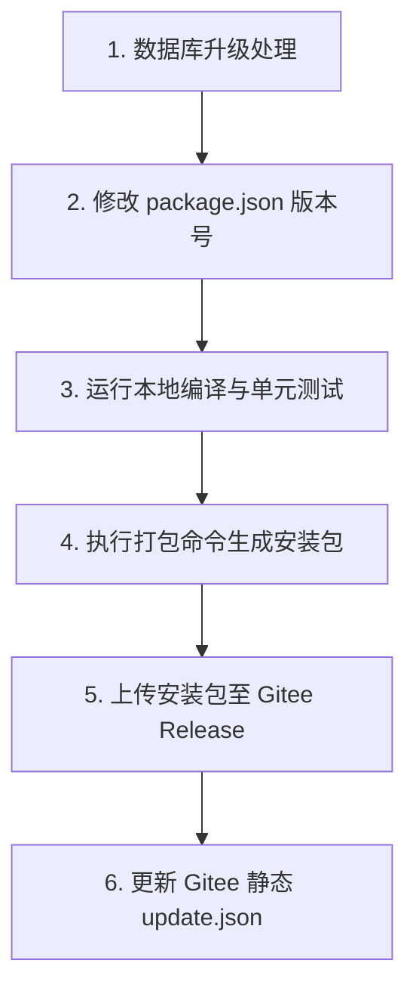

# Echo (回音) 客户端发布与更新版本操作指南

本指南旨在指导您在发布 Echo 客户端新版本时进行标准化操作，确保每一次版本升级都能平稳、安全地进行，并彻底防范本地 SQLite 数据库损坏、用户数据丢失、或客户端自动更新失败等重大事故。

---

## 📅 每次发布新版本必做的六大核心步骤



### 第一步：处理数据库结构升级（若无结构变动，可直接跳过）
如果您本次版本修改了本地 SQLite 数据库结构（例如新增了表、给旧表追加了新字段等），**绝对不能**直接在原数据库初始化 SQL 中硬编码修改，也**绝对不能**清空用户本地数据库。
必须严格按照以下步骤将其加入到 **数据库事务级增量迁移机制** 中：

1. 打开 [database.ts](file:///Users/lillian/github/project-echo/src/main/db/database.ts)。
2. **递增版本号**：找到全局版本定义 `CURRENT_SCHEMA_VERSION`（位于代码顶部或初始化类中），将其值**加 1**。
3. **编写迁移 SQL**：找到 `migrations` 数组，在数组的**最末端**追加新的增量迁移对象。
   > [!IMPORTANT]
   > 迁移 SQL 必须具备极高容错性且必须向下兼容（比如使用 `ALTER TABLE ... ADD COLUMN ...`，并提供合理的 `DEFAULT` 默认值）。
   > **禁止使用删除表或清空数据的危险 SQL**。

*示例（比如在 `migrations` 末尾新增 `v3` 迁移块）：*
```typescript
{
  version: 3,
  up: (db) => {
    // 🚀 健壮地为新表或旧表增量修改，即使重复执行也不会报错
    db.exec(`
      ALTER TABLE ForumPosts ADD COLUMN is_pinned INTEGER DEFAULT 0;
      CREATE TABLE IF NOT EXISTS UserNotes (
        id TEXT PRIMARY KEY,
        content TEXT,
        created_at INTEGER
      );
    `);
  }
}
```

---

### 第二步：修改项目版本号
1. 打开项目根目录下的 [package.json](file:///Users/lillian/github/project-echo/package.json)。
2. 将 `"version"` 字段修改为您的目标新版本（例如：从 `"1.0.0"` 升级到 `"1.1.0"`）。
   > [!WARNING]
   > 必须严格遵循 **Semver 语义化版本规范**（主版本号.次版本号.修订号，如 `1.1.0`）。
   > 该版本号将作为客户端检查更新时的核心比对凭据。

---

### 第三步：运行本地编译与单元测试
在执行打包之前，**必须**在本地进行一次全量校验，绝不能带着类型错误或逻辑 Regression 进行打包。
请在项目根目录下打开终端，依次运行以下命令：

1. **类型安全检查**：
   ```bash
   npx tsc --noEmit
   ```
   *要求：终端没有任何输出或报错。如果有任何 TS 报错，必须先将其解决。*

2. **核心逻辑回归测试**：
   ```bash
   npx vitest run tests/
   ```
   *要求：确保 13 个核心测试文件下的所有测试用例全数通过（显示全部绿色 Passed）。*

---

### 第四步：执行客户端打包 (首选 GitHub 云端打包，备用本地手动打包)

我们为您配置了高保真、跨平台的 **GitHub Actions 自动化流水线**。由于本项目引入了原生 C++ C-binding 依赖（`better-sqlite3`），在云端原生的虚拟机矩阵中进行编译打包是**100%防崩溃、防架构不匹配**的首选推荐方案。

#### 🚀 方案 A：通过 GitHub Actions 自动云端打包（强烈推荐）
您不需要在本地配置复杂的跨平台交叉编译环境，只需通过推送一个版本 Tag 即可触发云端多系统 Matrix 并行打包：

1. **创建本地 Tag**：
   在您项目根目录的终端中，创建一个与 `package.json` 中的新版本号相对应的 Git Tag（例如 `v1.1.0`）：
   ```bash
   git tag v1.1.0
   ```
2. **推送代码与 Tag 至 GitHub**：
   依次将最新的分支代码和 Tag 推送至您的 GitHub 私有库：
   ```bash
   git push origin main
   git push origin v1.1.0
   ```
3. **查看打包状态与下载安装包**：
   * 打开您的 GitHub 项目仓库，点击顶部导航栏的 **Actions** 选项卡，您能看到正在并发执行的 macOS、Windows、Linux 三大平台的构建任务。
   * 构建完成后（约 5~8 分钟），流水线会自动创建对应的 GitHub Release 页面。您只需直接去 Releases 页面下载打包好的 `.exe`、`.dmg`、`.AppImage` 附件即可！

---

#### 💻 方案 B：本地环境手动打包（备用方案）
如果您需要在本地直接手动打包，可在项目根目录下运行构建命令：
```bash
npm run build
```
打包成功后，将在 `dist/` 目录中生成对应系统的分发包：
* **Windows**：`.exe` 安装程序（例如 `dist/Echo-Setup-1.1.0.exe`）
* **macOS**：`.dmg` 镜像（例如 `dist/Echo-1.1.0-arm64.dmg` 或 `dist/Echo-1.1.0-x64.dmg`）
* **Linux**：`.AppImage` 包（例如 `dist/Echo-1.1.0.AppImage`）

---

### 第五步：上传安装包至 Gitee Release
1. 登录您的公开 Gitee 仓库：`https://gitee.com/andclear/echo`。
2. 创建一个新的 Release（发行版），Tag（标签）与您刚才在 `package.json` 中配置的版本号完全一致（例如 `v1.1.0`）。
3. 将第四步中生成的全部平台的安装包上传作为该 Release 的附件。
4. 复制每个附件的 **真实直链下载地址**（例如：`https://gitee.com/andclear/echo/releases/download/v1.1.0/Echo-Setup-1.1.0.exe`），这些链接将用于下一步的配置文件中。

---

### 第六步：更新 Gitee 静态 `update.json`
这是客户端检测自动更新的最关键一步。
1. 在您本地的 Gitee 仓库中，找到 `master` 分支根目录下的 `update.json`。
2. 精确修改该文件的配置信息。必须确保其包含所有平台的最新的直链，格式如下：

```json
{
  "version": "1.1.0",
  "changelog": "1. 优化了 AI 智能对话的响应延迟与上下文吞吐效率；\n2. 修复了客户端在特定分辨率下的布局微调问题；\n3. 重构并引入了全新的 SQLite 事务级数据迁移与后台静默更新机制。",
  "platforms": {
    "win32": {
      "url": "https://gitee.com/andclear/echo/releases/download/v1.1.0/Echo-Setup-1.1.0.exe"
    },
    "darwin_x64": {
      "url": "https://gitee.com/andclear/echo/releases/download/v1.1.0/Echo-1.1.0-x64.dmg"
    },
    "darwin_arm64": {
      "url": "https://gitee.com/andclear/echo/releases/download/v1.1.0/Echo-1.1.0-arm64.dmg"
    },
    "linux": {
      "url": "https://gitee.com/andclear/echo/releases/download/v1.1.0/Echo-1.1.0.AppImage"
    }
  }
}
```

3. **推送至 Gitee**：将此 `update.json` 物理提交并推送（Push）到 Gitee 的 `master` 分支。
   > [!CAUTION]
   > 客户端将通过 `https://gitee.com/andclear/echo/raw/master/update.json` 实时获取此信息。
   > 请绝对不要修改该文件的路径，也不要在 JSON 语法中残留任何注释或多余的分号，确保它是标准的、可被完美解析的 JSON 文件。

---

## 🚫 避免误操作的防呆红线 (Critical Pitfalls)

* 🔴 **红线一：严禁越过“第三步”直接打包！**
  如果带着未通过的单元测试打包，可能会导致客户端主功能运行中瘫痪。
* 🔴 **红线二：在 Gitee 上传包后，必须检查下载链接是否能直接免登录访问！**
  Gitee 的 Release 附件必须支持匿名直链下载。如果链接带了鉴权参数或重定向到了登录页面，客户端静默下载将完全报错。
* 🔴 **红线三：千万不要将 update.json 的 version 写错！**
  如果 `update.json` 中的 `version` 高于 `package.json`，但客户端实际上还是旧版本，会导致更新死循环（客户端启动 -> 检测到新版本 -> 下载安装 -> 还是旧版本 -> 重复提示更新）。

---

## 💡 补充章节：如何强制“无痛刷新”或重构当前版本 Tag？ (DevOps Tips)

在日常发版中，如果您已经将某个版本 Tag（例如 `v1.0.0`）推送到了 GitHub，但突然发现代码里遗漏了某些核心源文件或配置文件（或者构建流水线意外中断失败），您可能希望**在不强行提升版本号的前提下，让 GitHub Actions 重新针对当前 Tag 进行全自动构建打包**。

为了实现这套“无痛刷新”，您可以在项目根目录的终端中，执行以下这一行一气呵成的“黄金组合命令”：

```bash
git tag -d v1.0.0 && git push origin :refs/tags/v1.0.0 && git tag v1.0.0 && git push origin v1.0.0
```

### 🔍 命令步骤与物理原理解析：

1. **`git tag -d v1.0.0`**（本地删除旧 Tag）：
   * **作用**：物理抹除您**本地电脑**中名为 `v1.0.0` 的旧版本标签，为重新在最新提交上盖戳做准备。
2. **`git push origin :refs/tags/v1.0.0`**（远程删除旧 Tag）：
   * **作用**：将 **GitHub 远程服务器**上的 `v1.0.0` 标签彻底抹除。
   * **黑魔法原理**：推送时将冒号 `:` 放在引用 `refs/tags/...` 的前面，代表向远端推送一个空引用覆盖该标签，从而在服务器端物理删除这个 Tag。
3. **`git tag v1.0.0`**（本地重新创建健康 Tag）：
   * **作用**：以您本地**当前最新、最健康的 main 分支代码状态**，重新创建一个同名的 `v1.0.0` 本地标签。
4. **`git push origin v1.0.0`**（推送新 Tag 触发构建）：
   * **作用**：将这个全新的、健康的本地标签推送至 GitHub 仓库。当 GitHub 接收到这个 `v` 开头的新 Tag 时，会**瞬间重新触发云端的全自动打包流水线**，重新开始跨平台编译打包！
